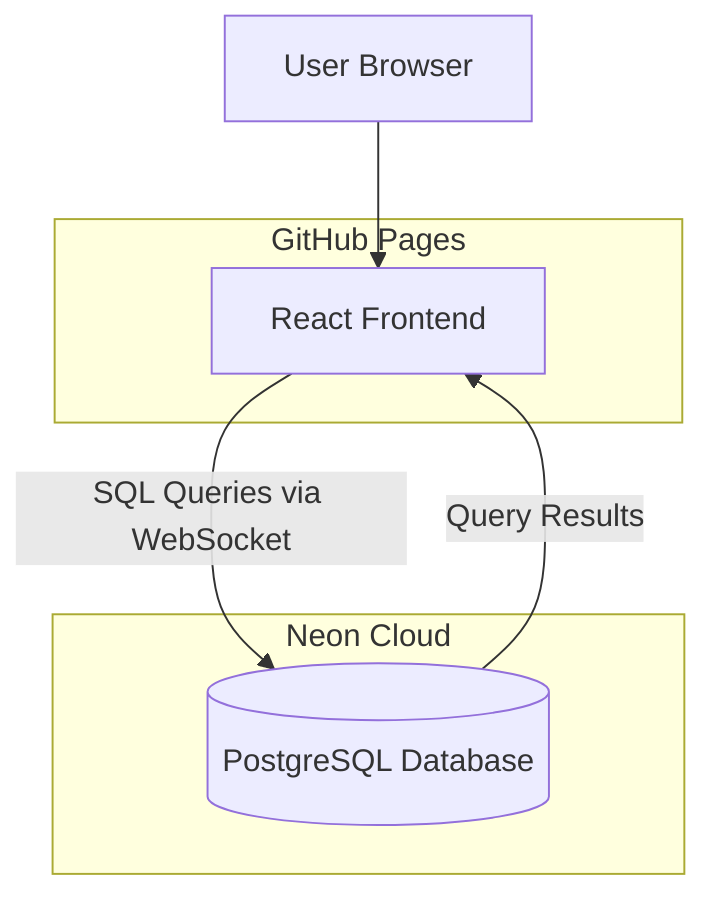

# Design Document: Song Studio

## Overview

Song Studio is a serverless web application that enables users to manage and present devotional songs (bhajans) in a PowerPoint-style slideshow format. The system uses a modern frontend framework deployed to GitHub Pages, connecting directly to a Neon PostgreSQL database for data persistence.

### Technology Stack

- **Frontend Framework**: React with Vite (for fast builds and GitHub Pages deployment)
- **UI Library**: Tailwind CSS for modern, responsive design
- **Database**: Neon serverless PostgreSQL
- **Database Client**: PostgreSQL client library (@neondatabase/serverless)
- **State Management**: React Context API + hooks
- **Routing**: React Router for navigation between views
- **Deployment**: GitHub Pages (static hosting)

### Key Design Decisions

1. **Serverless Architecture**: Direct frontend-to-database connection eliminates backend complexity and hosting costs
2. **Static Site Generation**: Vite + React enables fast builds and seamless GitHub Pages deployment
3. **PostgreSQL**: Neon provides serverless PostgreSQL with connection pooling, ideal for direct browser connections
4. **Component-Based UI**: React components for reusability and maintainability
5. **Responsive Design**: Tailwind CSS ensures the app works on various screen sizes

## Architecture

### System Architecture Diagram



### Application Structure

```
.
├── src/
│   ├── components/          # React components
│   │   ├── admin/          # Admin/management components
│   │   ├── presentation/   # Slideshow components
│   │   └── common/         # Shared components
│   ├── contexts/           # React contexts for state
│   ├── hooks/              # Custom React hooks
│   ├── services/           # Database service layer
│   ├── types/              # TypeScript type definitions
│   ├── utils/              # Utility functions
│   ├── App.tsx             # Main app component
│   └── main.tsx            # Entry point
├── public/                 # Static assets
└── index.html             # HTML entry point
```

## Components and Interfaces

### Core Components

#### 1. Admin Components

**SongManager**
- Purpose: CRUD operations for songs
- Props: None (uses context)
- Features: Form for creating/editing songs, list view, delete confirmation

**SingerManager**
- Purpose: CRUD operations for singers
- Props: None (uses context)
- Features: Form for creating/editing singers, list view

**PitchManager**
- Purpose: Manage pitch associations between songs and singers
- Props: `songId?: string, singerId?: string`
- Features: Association form, pitch input, list of existing associations

#### 2. Presentation Components

**SongList**
- Purpose: Display searchable list of songs
- Props: `onSongSelect: (songId: string) => void`
- Features: Search input, filter by singer, song cards

**SlideView**
- Purpose: Display individual slide with lyrics
- Props: `slide: Slide, showTranslation: boolean`
- Features: Large text display, translation toggle, song title

**PresentationMode**
- Purpose: Full-screen slideshow controller
- Props: `songId: string`
- Features: Keyboard navigation, slide progression, exit handler

**SlideNavigation**
- Purpose: Controls for navigating slides
- Props: `currentSlide: number, totalSlides: number, onNavigate: (index: number) => void`
- Features: Previous/next buttons, slide indicator

#### 3. Common Components

**SearchBar**
- Purpose: Reusable search input
- Props: `value: string, onChange: (value: string) => void, placeholder: string`

**Modal**
- Purpose: Reusable modal dialog
- Props: `isOpen: boolean, onClose: () => void, title: string, children: ReactNode`

**ErrorBoundary**
- Purpose: Catch and display errors gracefully
- Props: `children: ReactNode`

### Service Layer

**DatabaseService**
- Handles all database connections and queries
- Methods:
  - `connect()`: Establish connection to Neon
  - `query(sql, params)`: Execute parameterized queries
  - `disconnect()`: Close connection

**SongService**
- Methods:
  - `getAllSongs()`: Fetch all songs
  - `getSongById(id)`: Fetch single song with details
  - `createSong(data)`: Insert new song
  - `updateSong(id, data)`: Update existing song
  - `deleteSong(id)`: Delete song
  - `searchSongs(query)`: Search songs by name

**SingerService**
- Methods:
  - `getAllSingers()`: Fetch all singers
  - `getSingerById(id)`: Fetch single singer
  - `createSinger(data)`: Insert new singer
  - `updateSinger(id, data)`: Update existing singer
  - `deleteSinger(id)`: Delete singer

**PitchService**
- Methods:
  - `getPitchesForSong(songId)`: Get all pitch associations for a song
  - `getPitchesForSinger(singerId)`: Get all pitch associations for a singer
  - `createPitch(data)`: Create pitch association
  - `updatePitch(id, data)`: Update pitch association
  - `deletePitch(id)`: Delete pitch association

## Data Models

### Database Schema

```sql
-- Songs table
CREATE TABLE songs (
    id UUID PRIMARY KEY DEFAULT gen_random_uuid(),
    name VARCHAR(255) NOT NULL,
    lyrics TEXT NOT NULL,
    translation TEXT,
    created_at TIMESTAMP DEFAULT CURRENT_TIMESTAMP,
    updated_at TIMESTAMP DEFAULT CURRENT_TIMESTAMP
);

-- Singers table
CREATE TABLE singers (
    id UUID PRIMARY KEY DEFAULT gen_random_uuid(),
    name VARCHAR(255) NOT NULL,
    created_at TIMESTAMP DEFAULT CURRENT_TIMESTAMP,
    updated_at TIMESTAMP DEFAULT CURRENT_TIMESTAMP
);

-- Pitch associations table (many-to-many relationship)
CREATE TABLE song_singer_pitches (
    id UUID PRIMARY KEY DEFAULT gen_random_uuid(),
    song_id UUID NOT NULL REFERENCES songs(id) ON DELETE CASCADE,
    singer_id UUID NOT NULL REFERENCES singers(id) ON DELETE CASCADE,
    pitch VARCHAR(50) NOT NULL,
    created_at TIMESTAMP DEFAULT CURRENT_TIMESTAMP,
    updated_at TIMESTAMP DEFAULT CURRENT_TIMESTAMP,
    UNIQUE(song_id, singer_id)
);

-- Indexes for performance
CREATE INDEX idx_songs_name ON songs(name);
CREATE INDEX idx_song_singer_pitches_song_id ON song_singer_pitches(song_id);
CREATE INDEX idx_song_singer_pitches_singer_id ON song_singer_pitches(singer_id);
```

### TypeScript Interfaces

```typescript
interface Song {
    id: string;
    name: string;
    lyrics: string;
    translation?: string;
    createdAt: Date;
    updatedAt: Date;
}

interface Singer {
    id: string;
    name: string;
    createdAt: Date;
    updatedAt: Date;
}

interface SongSingerPitch {
    id: string;
    songId: string;
    singerId: string;
    pitch: string;
    createdAt: Date;
    updatedAt: Date;
}

interface Slide {
    index: number;
    content: string;
    translation?: string;
    songName: string;
}

interface SongWithPitches extends Song {
    pitches: Array<{
        singerId: string;
        singerName: string;
        pitch: string;
    }>;
}
```

## Slide Generation Logic

Songs will be split into slides based on line breaks in the lyrics. The algorithm:

1. Split lyrics by double line breaks (`\n\n`) to identify verses/sections
2. Each verse becomes one slide
3. If a verse is too long (>6 lines), split it into multiple slides
4. Apply the same splitting logic to translations
5. Pair original and translation content for each slide

```typescript
function generateSlides(song: Song): Slide[] {
    const verses = song.lyrics.split('\n\n').filter(v => v.trim());
    const translationVerses = song.translation?.split('\n\n').filter(v => v.trim()) || [];
    
    return verses.map((verse, index) => ({
        index,
        content: verse.trim(),
        translation: translationVerses[index]?.trim(),
        songName: song.name
    }));
}
```

## Error Handling

### Database Connection Errors
- Display user-friendly error message
- Provide retry mechanism
- Log errors to console for debugging
- Maintain offline state indicator

### Query Errors
- Catch and display specific error messages
- Rollback failed transactions
- Preserve user input on failure
- Show toast notifications for errors

### Validation Errors
- Client-side validation before database operations
- Display inline error messages on forms
- Highlight invalid fields
- Prevent submission until valid

### Error Boundary
- Wrap main app in ErrorBoundary component
- Display fallback UI on critical errors
- Provide "reload" option
- Log errors for debugging

## Testing Strategy

### Unit Tests
- Test utility functions (slide generation, text parsing)
- Test service layer methods with mocked database
- Test custom hooks with React Testing Library
- Target: 70% code coverage for utilities and services

### Component Tests
- Test component rendering with various props
- Test user interactions (clicks, keyboard events)
- Test form validation and submission
- Use React Testing Library and Vitest

### Integration Tests
- Test complete user flows (create song → present song)
- Test database operations with test database
- Test search and filter functionality
- Test presentation mode navigation

### Manual Testing Checklist
- [ ] Create, edit, delete songs
- [ ] Create, edit, delete singers
- [ ] Associate pitches with songs and singers
- [ ] Search and filter songs
- [ ] Present songs in full-screen mode
- [ ] Navigate slides with keyboard
- [ ] Verify responsive design on mobile/tablet
- [ ] Test with various lyric lengths and formats
- [ ] Verify translation display
- [ ] Test error scenarios (network failures, invalid data)

## Security Considerations

### Database Security
- Use Neon's connection string with SSL
- Store database credentials in environment variables
- Never commit credentials to repository
- Use read-only database user for presentation mode (optional enhancement)

### Input Validation
- Sanitize all user inputs before database insertion
- Use parameterized queries to prevent SQL injection
- Validate data types and lengths
- Escape special characters in lyrics/translations

### GitHub Pages Deployment
- Database connection string must be provided at build time or runtime
- Consider using environment variables for sensitive data
- Implement rate limiting on database queries (client-side)

## Performance Optimization

### Database Queries
- Use indexes on frequently queried columns
- Implement connection pooling via Neon
- Cache frequently accessed data in React state
- Use pagination for large song lists

### Frontend Performance
- Lazy load components with React.lazy()
- Implement virtual scrolling for long lists
- Optimize images and assets
- Use React.memo for expensive components
- Debounce search input

### Build Optimization
- Code splitting by route
- Tree shaking unused code
- Minify and compress assets
- Use Vite's build optimizations

## Deployment Process

### Build Configuration

```javascript
// vite.config.ts
export default defineConfig({
  base: '/songstudio/', // GitHub Pages subdirectory - update to match your repo name
  build: {
    outDir: 'dist',
    sourcemap: false,
    minify: 'terser'
  }
});
```

### GitHub Pages Setup
1. Build the application: `npm run build`
2. Deploy dist folder to gh-pages branch
3. Configure GitHub repository settings to serve from gh-pages
4. Set custom domain (optional)

### Environment Variables
- `VITE_NEON_CONNECTION_STRING`: Neon database connection string
- Store in `.env.local` for development
- Configure in GitHub Actions for automated deployment

## Future Enhancements

- Offline mode with local storage fallback
- Export songs to PDF or PowerPoint
- Audio playback integration
- Multi-language support beyond English
- User authentication and authorization
- Song categories and tags
- Playlist creation for events
- Analytics on song usage
